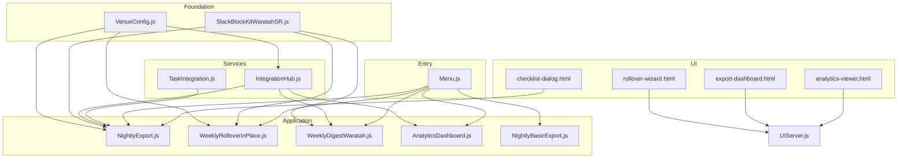
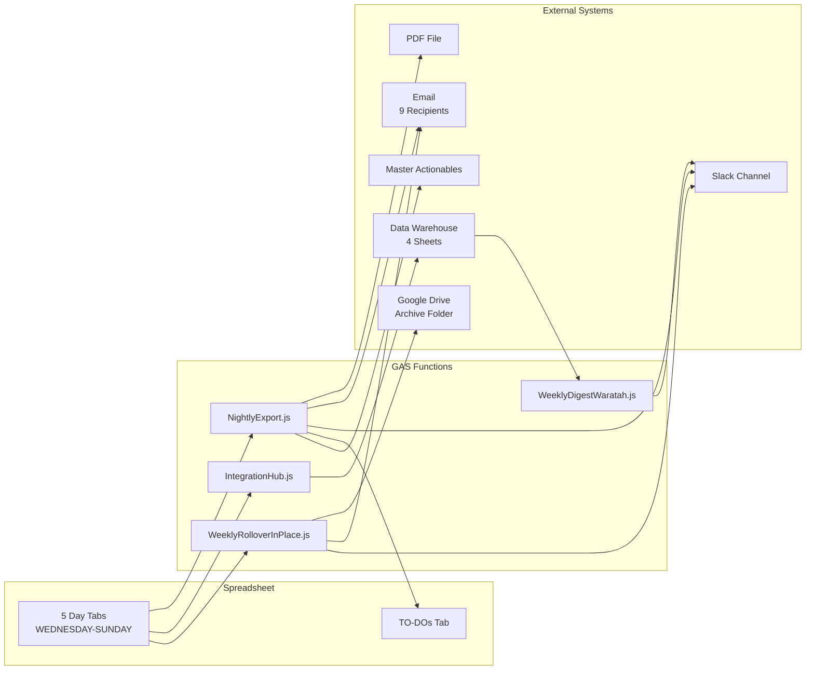

**Last updated:** March 6, 2026
**Audience:** Managers who want to understand the complete system, or anyone receiving a technical handover
**Prerequisite:** Read 01-BASIC and 02-INTERMEDIATE first — this guide assumes you understand the daily workflow and system components

# Complete Backend Reference

This document describes every code file, every function, every automated trigger, and every data connection in the Waratah shift report system. It explains what each piece does and how they work together.

---

## File Inventory

The system consists of 16 JavaScript files and 4 HTML files. Together they contain approximately 6,200 lines of code.

### Core Files (Used Every Day)

| File | Lines | What It Does |
|------|-------|-------------|
| **NightlyExport.js** | 1,016 | The main daily workflow. PDF generation, email distribution, Slack posting, TO-DO aggregation, task push to Master Actionables, weekly TO-DO summary. |
| **IntegrationHub.js** | 1,064 | Data warehouse orchestrator. Reads shift data from the spreadsheet, validates it, writes to 4 warehouse sheets with duplicate prevention, maintains an audit log. |
| **WeeklyRolloverInPlace.js** | 965 | Weekly rollover. Archives the week (PDF + spreadsheet copy), clears all data, updates dates to next week, sends notifications. |
| **Menu.js** | 156 | Builds the "Waratah Tools" menu when the spreadsheet opens. Password-gates all admin functions. |
| **VenueConfig.js** | 276 | Central configuration. Defines which cells to read for each data field, operating days, sheet names. Every other file depends on this. |
| **SlackBlockKitWaratahSR.js** | 159 | Builds formatted Slack messages. Provides 7 block-type functions (header, section, fields, divider, context, buttons, list) plus a posting function. |

### Supporting Files

| File | Lines | What It Does |
|------|-------|-------------|
| **WeeklyDigestWaratah.js** | 202 | Posts the weekly revenue comparison to Slack (this week vs last week). |
| **AnalyticsDashboard.js** | 517 | Builds formula-driven dashboards (Financial + Executive) in the data warehouse spreadsheet. |
| **NightlyBasicExport.js** | 261 | Standalone simplified export. Self-contained with its own configuration. Designed as a fallback if the main export breaks. |
| **UIServer.js** | 308 | Bridge between HTML dialogs and server-side functions. Serves the rollover wizard, export dashboard, and analytics viewer. |
| **TaskIntegration.js** | 59 | Configuration constants for the Master Actionables push (column positions, spreadsheet ID). |
| **DiagnoseSlack.js** | 170 | Diagnostic tools for testing Slack webhooks and viewing system configuration. |

### Setup and Test Files

| File | Lines | What It Does |
|------|-------|-------------|
| **_SETUP_ScriptProperties.js** | 222 | One-time setup script that creates all 18 configuration properties. Contains webhook secrets — excluded from version control. |
| **TEST_DataExtractionVerification.js** | 332 | Verifies that IntegrationHub reads the correct cells. Compares extracted data against manual cell reads. |
| **TEST_VenueConfig.js** | 212 | Test suite for the venue configuration system. |
| **TEST_SlackBlockKitLibrary.js** | 103 | Tests the Slack message builder functions. |

### HTML Dialog Files

| File | What It Does |
|------|-------------|
| **checklist-dialog.html** | The pre-send checklist (Deputy timesheets + fruit order). Disables the Send button until both are confirmed. |
| **rollover-wizard.html** | Visual interface for previewing and running the weekly rollover. |
| **export-dashboard.html** | Dashboard showing export status for each day this week. |
| **analytics-viewer.html** | Visual interface for viewing warehouse analytics. |

---

## How the Files Depend on Each Other

The files form a layered architecture. Lower-level files provide services that higher-level files consume.

**Foundation layer (no dependencies):**
- **VenueConfig.js** — Every file that reads cell data depends on this
- **SlackBlockKitWaratahSR.js** — Every file that posts to Slack depends on this

**Service layer (depends on foundation):**
- **IntegrationHub.js** — Uses VenueConfig for cell references
- **TaskIntegration.js** — Provides task push configuration

**Application layer (depends on foundation + services):**
- **NightlyExport.js** — Uses VenueConfig, SlackBlockKit, IntegrationHub, TaskIntegration
- **WeeklyRolloverInPlace.js** — Uses VenueConfig, SlackBlockKit
- **WeeklyDigestWaratah.js** — Uses IntegrationHub (for warehouse ID), SlackBlockKit
- **AnalyticsDashboard.js** — Uses IntegrationHub (for warehouse ID)

**Entry point:**
- **Menu.js** — Calls functions from all application-layer files via menu items

**UI layer:**
- **checklist-dialog.html** — Calls `continueExport()` in NightlyExport.js
- **rollover-wizard.html** — Calls functions in UIServer.js
- **export-dashboard.html** — Calls functions in UIServer.js
- **analytics-viewer.html** — Calls functions in UIServer.js



---

## Function Reference

Every function that the system exposes (callable from menus, triggers, or HTML dialogs).

### NightlyExport.js — Daily Export Functions

| Function | How It's Called | What It Does |
|----------|----------------|-------------|
| `exportAndEmailPDF()` | Menu: Daily Reports > Export & Email PDF (LIVE) | Validates the active sheet, shows confirmation, opens the checklist dialog. |
| `exportAndEmailPDF_TestToSelf()` | Menu: Daily Reports > Export & Email (TEST to me) | Same as above but routes to test email/Slack. |
| `continueExport(sheetName, isTest)` | Called from checklist-dialog.html when both boxes are ticked | Runs the full 9-step pipeline: warehouse logging, TO-DO aggregation, Slack, task push, PDF, email, warnings. |
| `postToSlackFromSheet(...)` | Called from continueExport | Builds and posts the Block Kit message to Slack. |
| `pushTodosToMasterActionables(...)` | Called from continueExport | Copies tasks to the Master Actionables spreadsheet with deduplication. |
| `buildTodoAggregationSheet_(...)` | Called from continueExport | Rebuilds the TO-DOs summary tab from all 5 day sheets. |
| `generatePdfForSheet_NoUI_(...)` | Called from continueExport | Creates a PDF blob of the active sheet using Google's export URL. |
| `sendWeeklyTodoSummary_WARATAH()` | Menu: Admin > Weekly Reports > Weekly To-Do Summary (LIVE) | Compiles all week's tasks and posts a summary to Slack. |
| `backfillAllDaysTodos()` | Menu: Admin > Setup > Backfill TO-DOs (All Days) | Pushes all 5 days' tasks to Master Actionables at once. |

### IntegrationHub.js — Data Warehouse Functions

| Function | How It's Called | What It Does |
|----------|----------------|-------------|
| `runIntegrations(sheetName)` | Called from continueExport | Main entry point. Extracts data, validates, logs to warehouse, writes audit trail. |
| `extractShiftData_(sheetName, config)` | Called from runIntegrations | Reads approximately 30 cells from the specified sheet and returns a structured data object. |
| `logToDataWarehouse_(shiftData, config)` | Called from runIntegrations | Writes to 4 warehouse sheets (NIGHTLY_FINANCIAL, OPERATIONAL_EVENTS, WASTAGE_COMPS, QUALITATIVE_LOG) with duplicate checking. |
| `validateShiftData_(shiftData)` | Called from runIntegrations | Checks that required fields (date, MOD, revenue) are present and valid. |
| `showIntegrationLogStats()` | Menu: Admin > Data Warehouse > Show Integration Log | Displays a summary of all warehouse writes. |
| `backfillShiftToWarehouse()` | Menu: Admin > Data Warehouse > Backfill Current Sheet | Manually pushes the active sheet's data to the warehouse. |
| `runWeeklyBackfill_()` | Automatic trigger: Monday 8am | Scans all 5 sheets and logs any that weren't already in the warehouse. |
| `runValidationReport()` | Run from Apps Script editor | Health check: validates all connections and data extraction. |

### WeeklyRolloverInPlace.js — Rollover Functions

| Function | How It's Called | What It Does |
|----------|----------------|-------------|
| `performWeeklyRollover()` | Automatic trigger: Monday 10am + Menu (password required) | Full rollover: validate, summarise, archive PDF, archive spreadsheet, clear data, update dates, notify. |
| `previewRollover()` | Menu: Admin > Weekly Rollover > Preview (Dry Run) | Shows what the rollover would do without executing. |
| `createWeeklyRolloverTrigger()` | Menu: Admin > Weekly Rollover > Create Trigger | Installs the Monday 10am timer. Removes any existing trigger first. |
| `removeWeeklyRolloverTrigger()` | Menu: Admin > Weekly Rollover > Remove Trigger | Removes the Monday timer. |
| `fixSheetNamesAndDateFormat()` | Menu: Admin > Setup > Fix Tab Names | Repairs tab names and date formatting if they've been accidentally changed. |

### WeeklyDigestWaratah.js — Revenue Digest Functions

| Function | How It's Called | What It Does |
|----------|----------------|-------------|
| `sendWeeklyRevenueDigest_Waratah()` | Automatic trigger: Monday 9am + Menu (password required) | Reads warehouse data, compares this week vs last week, posts to Slack. |
| `setupWeeklyDigestTrigger_Waratah()` | Menu: Admin > Weekly Digest > Setup Trigger | Installs the Monday 9am timer. |

### Menu.js — Menu and Access Control

| Function | How It's Called | What It Does |
|----------|----------------|-------------|
| `onOpen()` | Automatic: when the spreadsheet opens | Builds the entire "Waratah Tools" menu. Runs every time any user opens the spreadsheet. |
| `requirePassword_()` | Called before any admin function | Prompts for the admin password. Blocks execution if incorrect. |

### AnalyticsDashboard.js — Dashboard Builder

| Function | How It's Called | What It Does |
|----------|----------------|-------------|
| `buildFinancialDashboard()` | Menu: Admin > Analytics > Build Financial Dashboard | Creates a QUERY/SUMIFS-based financial dashboard in the warehouse. |
| `buildExecutiveDashboard()` | Menu: Admin > Analytics > Build Executive Dashboard | Creates an executive summary dashboard in the warehouse. |

### NightlyBasicExport.js — Fallback Export

| Function | How It's Called | What It Does |
|----------|----------------|-------------|
| `sendShiftReportBasic()` | Menu: Daily Reports > Send Basic Report | Self-contained export: validates, generates PDF, emails, posts plain-text Slack, copies TO-DOs. No warehouse logging, no task push. |

---

## Cell Reference Map

Every cell the system reads from or writes to on a shift report sheet.

### Financial Cells

| Cell | Field | Type | Warehouse Column |
|------|-------|------|-----------------|
| B3:F3 | Date | Merged, pre-filled by rollover | A: Date |
| B4:F4 | MOD | Merged, manual entry | D: MOD |
| B5:F5 | Staff | Merged, manual entry | E: Staff |
| B8 | Production amount | Manual entry | G: ProductionAmount |
| B9:B10 | Deposit | Manual entry | Not warehoused |
| B11 | Airbnb covers | Manual entry | Not warehoused |
| B13:B14 | Cancellations | Manual entry | Not warehoused |
| B15 | Cash takings | **Formula** | H: CashTakings |
| B16 | Gross sales inc cash | **Formula or entry** | I: GrossSalesIncCash |
| B17:B18 | Cash returns | Merged pair | J: CashReturns |
| B19:B20 | CD discount | Merged pair | K: CDDiscount |
| B21:B22 | Refunds | Merged pair | L: Refunds |
| B23:B24 | CD redeem | Merged pair | M: CDRedeem |
| B25 | Total discount | Entry | N: TotalDiscount |
| B26 | Discounts/comps exc CD | **Formula** | O: DiscountsCompsExcCD |
| B27 | Gross taxable sales | **Formula** | P: GrossTaxableSales |
| B28 | Taxes | **Formula** | Q: Taxes |
| B29 | Net sales with tips | **Formula** | R: NetSalesWTips |
| B30 | Petty cash | Manual entry | Not warehoused |
| B32 | Card tips | Manual entry | S: CardTips |
| B33 | Cash tips | Manual entry | T: CashTips |
| B34 | Net revenue | Manual entry | F: NetRevenue |
| B36 | Covers | Manual entry | Not warehoused |
| B37 | Total tips | **Formula** (DO NOT CLEAR) | U: TotalTips |
| B38 | Labour hours | **Formula** (DO NOT CLEAR) | Not warehoused |
| B39 | Labour cost | **Formula** (DO NOT CLEAR) | Not warehoused |

### Narrative Cells (Merged A:F, value in column A)

| Cell | Field | Warehouse Column |
|------|-------|-----------------|
| A43 | Shift summary | QUALITATIVE_LOG: ShiftSummary |
| A45 | VIP / Guests of note | QUALITATIVE_LOG: VIPNotes |
| A47 | The Good | QUALITATIVE_LOG: TheGood |
| A49 | The Bad / Issues | QUALITATIVE_LOG: TheBad |
| A51 | Kitchen notes | QUALITATIVE_LOG: KitchenNotes |

### Task Cells

| Cell Range | Field | Destination |
|------------|-------|-------------|
| A53:E61 | Task descriptions (9 rows, merged A:E per row) | OPERATIONAL_EVENTS + Master Actionables |
| F53:F61 | Task assignees (9 rows) | OPERATIONAL_EVENTS + Master Actionables |

### Incident Cells (Merged A:F)

| Cell | Field | Warehouse Column |
|------|-------|-----------------|
| A63:F63 | Wastage/comps | WASTAGE_COMPS + QUALITATIVE_LOG |
| A65:F65 | RSA incidents | QUALITATIVE_LOG: RSAIncidents |

---

## Automated Triggers

Three time-based triggers run the automated components. These are set up once and run indefinitely until removed.

| Trigger | Schedule | Function | File | Purpose |
|---------|----------|----------|------|---------|
| Weekly Rollover | Monday 10:00am AEST | `performWeeklyRollover()` | WeeklyRolloverInPlace.js | Archive, clear, update dates, notify |
| Weekly Revenue Digest | Monday 9:00am AEST | `sendWeeklyRevenueDigest_Waratah()` | WeeklyDigestWaratah.js | This-week vs last-week Slack comparison |
| Weekly Backfill | Monday 8:00am AEST | `runWeeklyBackfill_()` | IntegrationHub.js | Catch unlogged shifts |

Plus one event trigger:

| Trigger | Event | Function | File |
|---------|-------|----------|------|
| Menu creation | Spreadsheet opened | `onOpen()` | Menu.js |

**To check if triggers are active:** Extensions > Apps Script > Triggers (clock icon on the left sidebar).

**To recreate a trigger:** Use the corresponding setup function from the Admin menu, or run it from the Apps Script editor.

---

## Script Properties (System Configuration)

The system stores 18 configuration values as Google Apps Script "Script Properties" — key-value pairs that are accessible to all code in the project but not visible in the spreadsheet.

| Property | What It Controls |
|----------|-----------------|
| `VENUE_NAME` | Set to "WARATAH" — used to load the correct cell configuration |
| `MENU_PASSWORD` | Password required for admin menu functions |
| `WARATAH_SLACK_WEBHOOK_LIVE` | Slack webhook URL for the live Waratah channel |
| `WARATAH_SLACK_WEBHOOK_TEST` | Slack webhook URL for the test channel |
| `WARATAH_EMAIL_RECIPIENTS` | JSON array of 9 email addresses for report distribution |
| `WARATAH_SHIFT_REPORT_CURRENT_ID` | Google Sheets ID of the current shift report spreadsheet |
| `WARATAH_WORKING_FILE_ID` | Same as above — used by rollover for validation |
| `WARATAH_DATA_WAREHOUSE_ID` | Google Sheets ID of the data warehouse |
| `WARATAH_TASK_MANAGEMENT_ID` | Google Sheets ID of the task management spreadsheet |
| `TASK_MANAGEMENT_SPREADSHEET_ID` | Same as above — used by TaskIntegration.js |
| `ARCHIVE_ROOT_FOLDER_ID` | Google Drive folder ID where archives are saved |
| `WARATAH_CASH_RECON_FOLDER_ID` | Reserved for future cash reconciliation feature |
| `SLACK_MANAGERS_CHANNEL_WEBHOOK` | Managers-only Slack channel webhook |
| `INTEGRATION_ALERT_EMAIL_PRIMARY` | Email address for system error alerts |
| `INTEGRATION_ALERT_EMAIL_SECONDARY` | Backup email for error alerts |
| `ESCALATION_EMAIL` | Email for task escalation notifications |
| `ESCALATION_SLACK_WEBHOOK` | Slack webhook for task escalation |
| `SLACK_DM_WEBHOOKS` | JSON object mapping staff names to personal Slack webhooks |

**These are set once during initial setup** using `_SETUP_ScriptProperties.js` (which is excluded from version control because it contains webhook secrets). They rarely need to change. If someone new joins the email distribution list, the `WARATAH_EMAIL_RECIPIENTS` property needs to be updated in the Apps Script editor (File > Project Settings > Script Properties).

---

## Data Flow Diagram

This shows how data moves from the spreadsheet through the system to external destinations.



---

## Error Handling Philosophy

The system is designed to be **non-destructive and fault-tolerant:**

- Every step in the nightly export pipeline is wrapped in error handling. If the Slack notification fails, the email still sends. If the warehouse logging fails, the PDF still generates. No single failure stops the entire pipeline.

- When any step fails, a warning notification is sent to Evan via Slack with details of what went wrong. The manager who clicked Send sees a success message because the core delivery (PDF + email) completed.

- The weekly rollover uses a **lock** to prevent two copies from running at the same time (for example, if someone manually triggers it while the automatic timer is also running). The second instance waits up to 30 seconds for the first to finish, then gives up.

- All warehouse writes use **duplicate prevention**. The system checks if today's data has already been logged before writing. This means re-running the export or backfill is always safe — it won't create duplicate rows.

---

## Key Technical Rules

These are the system constraints that matter when anyone is maintaining or troubleshooting the system.

### Formula Cells Must Never Be Cleared

Cells B15, B16, B26, B27, B28, B29, B37, B38, and B39 contain formulas. They are deliberately excluded from the rollover's clear operation. If a formula is accidentally deleted, it must be restored from an archived copy.

### Merged Cells Require Full-Range References

Narrative cells (A43, A45, A47, A49, A51) and task cells (A53:E53 through A61:E61) are merged across columns A through F. The value lives in column A. Trying to clear or read from columns B-F of a merged range does nothing — you must reference the full range starting from column A.

### The Password System

All admin menu items are wrapped in password check functions. The password is stored in the `MENU_PASSWORD` Script Property. If someone enters the wrong password, the function stops immediately. The password is the same for all admin functions.

### UI Functions in Trigger Context

Some functions can run both from a menu click (interactive) and from an automatic trigger (non-interactive). When running from a trigger, any attempt to show a dialog or alert will fail. All such calls are wrapped in error handling so the function continues silently when running from a trigger.

---

## Warehouse Schema Detail

### NIGHTLY_FINANCIAL (22 columns, A through V)

| Column | Header | Source |
|--------|--------|--------|
| A | Date | B3 (parsed) |
| B | Day | Calculated (day name) |
| C | WeekEnding | Calculated (next Sunday) |
| D | MOD | B4 |
| E | Staff | B5 |
| F | NetRevenue | B34 |
| G | ProductionAmount | B8 |
| H | CashTakings | B15 |
| I | GrossSalesIncCash | B16 |
| J | CashReturns | B17 |
| K | CDDiscount | B19 |
| L | Refunds | B21 |
| M | CDRedeem | B23 |
| N | TotalDiscount | B25 |
| O | DiscountsCompsExcCD | B26 |
| P | GrossTaxableSales | B27 |
| Q | Taxes | B28 |
| R | NetSalesWTips | B29 |
| S | CardTips | B32 |
| T | CashTips | B33 |
| U | TotalTips | B37 |
| V | LoggedAt | Timestamp |

### OPERATIONAL_EVENTS (8 columns)

| Column | Header |
|--------|--------|
| A | Date |
| B | Day |
| C | MOD |
| D | TaskDescription |
| E | AssignedTo |
| F | SheetName |
| G | WeekEnding |
| H | LoggedAt |

### WASTAGE_COMPS (6 columns)

| Column | Header |
|--------|--------|
| A | Date |
| B | Day |
| C | MOD |
| D | WastageNotes |
| E | WeekEnding |
| F | LoggedAt |

### QUALITATIVE_LOG (11 columns)

| Column | Header |
|--------|--------|
| A | Date |
| B | Day |
| C | MOD |
| D | ShiftSummary |
| E | VIPNotes |
| F | TheGood |
| G | TheBad |
| H | KitchenNotes |
| I | WastageNotes |
| J | RSAIncidents |
| K | LoggedAt |

---

## Archive Folder Structure

When the weekly rollover runs, it saves files in this structure on Google Drive:

```
Archive/
  2026/
    2026-02/
      pdfs/
        Waratah_Shift_Report_WE_02.03.2026.pdf
      sheets/
        Waratah_Shift_Report_WE_02.03.2026  (full spreadsheet copy)
    2026-03/
      pdfs/
        Waratah_Shift_Report_WE_09.03.2026.pdf
      sheets/
        Waratah_Shift_Report_WE_09.03.2026
```

Folders are created automatically if they don't exist. The naming convention uses the Week Ending date (always a Sunday).
